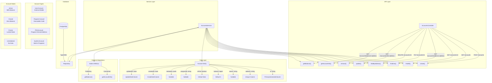

# Accounts and Programs

```mermaid
graph TD
    subgraph "API Layer"
        AC[AccountsController]
        AC -->|"POST /accounts"| ACS1["create()"]
        AC -->|"GET /accounts"| ACS2["findAll()"]
        AC -->|"GET /accounts/:id"| ACS3["findOne()"]
        AC -->|"GET /accounts/address/:address"| ACS4["findByAddress()"]
        AC -->|"PUT /accounts/:id"| ACS5["update()"]
        AC -->|"DELETE /accounts/:id"| ACS6["remove()"]
        AC -->|"GET /accounts/info/:address"| ACS7["getAccountInfo()"]
        AC -->|"GET /accounts/balance/:address"| ACS8["getBalance()"]
    end

    subgraph "Service Layer"
        AS[AccountsService]
        AS --> ACS1
        AS --> ACS2
        AS --> ACS3
        AS --> ACS4
        AS --> ACS5
        AS --> ACS6
        AS --> ACS7
        AS --> ACS8
    end

    subgraph "Data Layer"
        AE["Account Entity"]
        AE -->|"id: string"| AE1[PrimaryGeneratedColumn]
        AE -->|"address: string"| AE2["Unique Column"]
        AE -->|"owner: string"| AE3[Nullable]
        AE -->|"balance: bigint"| AE4["Default 0"]
        AE -->|"isPda: boolean"| AE5["Default false"]
        AE -->|"programId: string"| AE6[Nullable]
        AE -->|"metadata: jsonb"| AE7[Nullable]
        AE -->|"createdAt: Date"| AE8[CreateDateColumn]
        AE -->|"updatedAt: Date"| AE9[UpdateDateColumn]
    end

    subgraph "External Integrations"
        SOL["Solana Web3.js"]
        SOL -->|"Connection"| SOL1["getAccountInfo()"]
        SOL -->|"PublicKey"| SOL2["getBalance()"]
    end

    subgraph "Database"
        DB[(PostgreSQL)]
        DB -->|"TypeORM"| DB1["Repository<Account>"]
        DB1 --> AS
    end

    AS --> AE
    AS --> SOL
    AS --> DB1

    subgraph "Account Types"
        AT1["User Account<br/>External Wallet"]
        AT2["Program Account<br/>Executable Code"]
        AT3["PDA Account<br/>Program Derived Address"]
        AT4["System Account<br/>Built-in Programs"]
    end

    subgraph "Account States"
        ST1["Active<br/>With Balance"]
        ST2["Closed<br/>Zero Balance"]
        ST3["Frozen<br/>Locked State"]
        ST4["Uninitialized<br/>No Data"]
    end
```