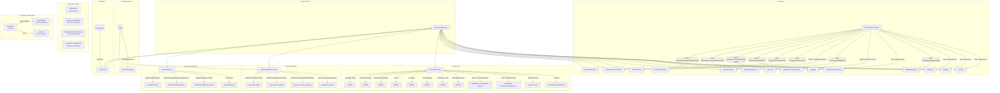

# Transactions and Instructions

```mermaid
graph TD
    subgraph "API Layer"
        TC[TransactionsController]
        TC -->|"POST /transactions"| TCS1["create()"]
        TC -->|"GET /transactions"| TCS2["findAll()"]
        TC -->|"GET /transactions/:id"| TCS3["findOne()"]
        TC -->|"GET /transactions/signature/:sig"| TCS4["findBySignature()"]
        TC -->|"PUT /transactions/:id"| TCS5["update()"]
        TC -->|"DELETE /transactions/:id"| TCS6["remove()"]
        TC -->|"GET /transactions/details/:sig"| TCS7["getTransaction()"]
        TC -->|"POST /transactions/transfer"| TCS8["sendTransfer()"]
        TC -->|"GET /transactions/recent/list"| TCS9["getRecentTransactions()"]
        TC -->|"GET /transactions/fee/estimate"| TCS10["getFeeEstimate()"]
        TC -->|"POST /transactions/events/test"| TCS11["createTestTransaction()"]
        TC -->|"POST /transactions/:id/events/status-update"| TCS12["updateTransactionStatus()"]
        TC -->|"GET /transactions/events/publisher/status"| TCS13["getPublisherStatus()"]
        TC -->|"POST /transactions/events/publisher/flush"| TCS14["forceFlushEvents()"]
    end

    subgraph "Service Layer"
        TS[TransactionsService]
        TS --> TCS1
        TS --> TCS2
        TS --> TCS3
        TS --> TCS4
        TS --> TCS5
        TS --> TCS6
        TS --> TCS7
        TS --> TCS8
        TS --> TCS9
        TS --> TCS10
    end

    subgraph "Event Publishing"
        MPS[MessagePublisherService]
        MPS -->|"publishTransactionCreated()"| EVT1["transaction.created"]
        MPS -->|"publishTransactionStatusUpdated()"| EVT2["transaction.status_updated"]
        MPS -->|"publishTransactionConfirmed()"| EVT3["transaction.confirmed"]
        MPS -->|"publishTransactionFailed()"| EVT4["transaction.failed"]
    end

    subgraph "Data Layer"
        TE["Transaction Entity"]
        TE -->|"id: string"| TE1[PrimaryGeneratedColumn]
        TE -->|"signature: string"| TE2["Unique Column"]
        TE -->|"type: TransactionType"| TE3["TRANSFER, TOKEN_TRANSFER, etc."]
        TE -->|"status: TransactionStatus"| TE4["PENDING, CONFIRMED, FAILED"]
        TE -->|"fromAddress: string"| TE5[Nullable]
        TE -->|"toAddress: string"| TE6[Nullable]
        TE -->|"amount: bigint"| TE7["Default 0"]
        TE -->|"fee: bigint"| TE8[Nullable]
        TE -->|"slot: int"| TE9[Nullable]
        TE -->|"blockTime: timestamp"| TE10[Nullable]
        TE -->|"instructions: jsonb"| TE11[Nullable]
        TE -->|"metadata: jsonb"| TE12[Nullable]
    end

    subgraph "External Integrations"
        SOL["Solana Web3.js"]
        SOL -->|"Connection"| SOL1["getTransaction()"]
        SOL -->|"SystemProgram.transfer()"| SOL2["sendAndConfirmTransaction()"]
        SOL -->|"getConfirmedSignaturesForAddress2()"| SOL3["getRecentTransactions()"]
        SOL -->|"getRecentBlockhash()"| SOL4["getFeeEstimate()"]
    end

    subgraph "Message Queue"
        KF[(Kafka)]
        KF -->|"transaction-events"| KF1["Event Streaming"]
        KF --> MPS
    end

    subgraph "Database"
        DB[(PostgreSQL)]
        DB -->|"TypeORM"| DB1["Repository<Transaction>"]
        DB1 --> TS
    end

    TS --> TE
    TS --> MPS
    TS --> SOL
    TS --> DB1

    subgraph "Transaction Types"
        TT1["TRANSFER<br/>SOL Transfer"]
        TT2["TOKEN_TRANSFER<br/>SPL Token Transfer"]
        TT3["PROGRAM_INTERACTION<br/>Smart Contract Call"]
        TT4["ACCOUNT_CREATION<br/>New Account Setup"]
    end

    subgraph "Transaction Status Flow"
        SF1["PENDING<br/>Created"]
        SF2["CONFIRMED<br/>On-chain Success"]
        SF3["FAILED<br/>Error Occurred"]
    end

    SF1 -->|"Status Update"| SF2
    SF1 -->|"Error"| SF3
```