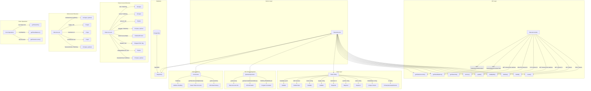

# Token Standards (SPL Tokens)

```mermaid
graph TD
    subgraph "API Layer"
        TNC[TokensController]
        TNC -->|"POST /tokens"| TNCS1["create()"]
        TNC -->|"GET /tokens"| TNCS2["findAll()"]
        TNC -->|"GET /tokens/:id"| TNCS3["findOne()"]
        TNC -->|"GET /tokens/mint/:address"| TNCS4["findByMint()"]
        TNC -->|"PUT /tokens/:id"| TNCS5["update()"]
        TNC -->|"DELETE /tokens/:id"| TNCS6["remove()"]
        TNC -->|"GET /tokens/info/:address"| TNCS7["getTokenInfo()"]
        TNC -->|"GET /tokens/balance/:owner/:mint"| TNCS8["getTokenBalance()"]
        TNC -->|"GET /tokens/accounts/:owner"| TNCS9["getTokenAccounts()"]
    end

    subgraph "Service Layer"
        TNS[TokensService]
        TNS --> TNCS1
        TNS --> TNCS2
        TNS --> TNCS3
        TNS --> TNCS4
        TNS --> TNCS5
        TNS --> TNCS6
        TNS --> TNCS7
        TNS --> TNCS8
        TNS --> TNCS9
    end

    subgraph "Data Layer"
        TNE[Token Entity]
        TNE -->|"id: string"| TNE1[PrimaryGeneratedColumn]
        TNE -->|"mintAddress: string"| TNE2[Unique Column]
        TNE -->|"name: string"| TNE3[Required]
        TNE -->|"symbol: string"| TNE4[Required]
        TNE -->|"decimals: int"| TNE5[Required]
        TNE -->|"supply: string"| TNE6[Nullable]
        TNE -->|"owner: string"| TNE7[Nullable]
        TNE -->|"isNft: boolean"| TNE8[Default false]
        TNE -->|"metadata: jsonb"| TNE9[Nullable]
    end

    subgraph "SPL Token Integration"
        SPL["@solana/spl-token"]
        SPL -->|"TOKEN_PROGRAM_ID"| SPL1[Program Constants]
        SPL -->|"getAssociatedTokenAddress()"| SPL2[ATA Derivation]
        SPL -->|"getAccount()"| SPL3[Token Account Info]
    end

    subgraph "Solana Web3.js"
        SOL[Connection]
        SOL -->|"getAccountInfo()"| SOL1[Mint Data Parsing]
        SOL -->|"getTokenAccountsByOwner()"| SOL2[Owner Token Accounts]
        SOL -->|"PublicKey"| SOL3[Address Handling]
    end

    subgraph "Database"
        DB[(PostgreSQL)]
        DB -->|"TypeORM"| DB1["Repository<Token>"]
        DB1 --> TNS
    end

    TNS --> TNE
    TNS --> SPL
    TNS --> SOL
    TNS --> DB1

    subgraph "Token Account Structure"
        TAS[Token Account]
        TAS -->|"mint: PublicKey"| TAS1[32 bytes]
        TAS -->|"owner: PublicKey"| TAS2[32 bytes]
        TAS -->|"amount: u64"| TAS3[8 bytes]
        TAS -->|"delegate: PublicKey"| TAS4[32 bytes, optional]
        TAS -->|"state: AccountState"| TAS5[Initialized/Frozen]
        TAS -->|"isNative: u64"| TAS6[Wrapped SOL flag]
        TAS -->|"delegatedAmount: u64"| TAS7[8 bytes]
        TAS -->|"closeAuthority: PublicKey"| TAS8[32 bytes, optional]
    end

    subgraph "Mint Account Structure"
        MAS[Mint Account]
        MAS -->|"mintAuthority: PublicKey"| MAS1[32 bytes, optional]
        MAS -->|"supply: u64"| MAS2[8 bytes]
        MAS -->|"decimals: u8"| MAS3[1 byte]
        MAS -->|"isInitialized: bool"| MAS4[1 byte]
        MAS -->|"freezeAuthority: PublicKey"| MAS5[32 bytes, optional]
    end

    subgraph "Token Operations"
        OPS[Core Operations]
        OPS -->|"Get Token Info"| OPS1["getTokenInfo()"]
        OPS -->|"Get Balance"| OPS2["getTokenBalance()"]
        OPS -->|"Get Accounts"| OPS3["getTokenAccounts()"]
    end
```