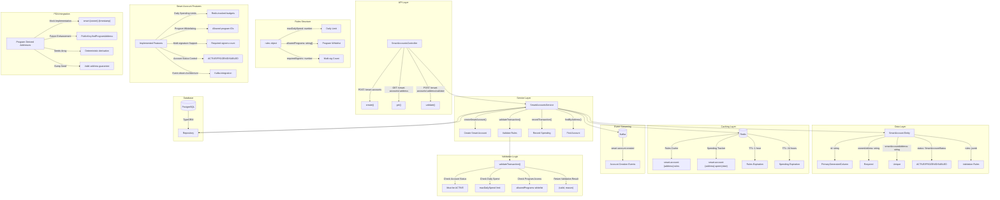

# Account Abstraction

```mermaid
graph TD
    subgraph "API Layer"
        SAC[SmartAccountsController]
        SAC -->|"POST /smart-accounts"| SACS1["create()"]
        SAC -->|"GET /smart-accounts/:address"| SACS2["get()"]
        SAC -->|"POST /smart-accounts/:address/validate"| SACS3["validate()"]
    end

    subgraph "Service Layer"
        SAS[SmartAccountsService]
        SAS -->|"createSmartAccount()"| SAS1[Create Smart Account]
        SAS -->|"validateTransaction()"| SAS2[Validate Rules]
        SAS -->|"recordTransaction()"| SAS3[Record Spending]
        SAS -->|"findByAddress()"| SAS4[Find Account]
    end

    subgraph "Data Layer"
        SAE[SmartAccount Entity]
        SAE -->|"id: string"| SAE1[PrimaryGeneratedColumn]
        SAE -->|"ownerAddress: string"| SAE2[Required]
        SAE -->|"smartAccountAddress: string"| SAE3[Unique]
        SAE -->|"status: SmartAccountStatus"| SAE4[ACTIVE/FROZEN/DISABLED]
        SAE -->|"rules: jsonb"| SAE5[Validation Rules]
    end

    subgraph "Rules Structure"
        RLS[rules object]
        RLS -->|"maxDailySpend: number"| RLS1[Daily Limit]
        RLS -->|"allowedPrograms: string[]"| RLS2[Program Whitelist]
        RLS -->|"requiredSigners: number"| RLS3[Multi-sig Count]
    end

    subgraph "Caching Layer"
        RED[(Redis)]
        RED -->|"Rules Cache"| RED1["smart-account:{address}:rules"]
        RED -->|"Spending Tracker"| RED2["smart-account:{address}:spent:{date}"]
        RED -->|"TTL: 1 hour"| RED3[Rules Expiration]
        RED -->|"TTL: 24 hours"| RED4[Spending Expiration]
    end

    subgraph "Event Streaming"
        KAF[(Kafka)]
        KAF -->|"smart-account.created"| KAF1[Account Creation Events]
    end

    subgraph "Database"
        DB[(PostgreSQL)]
        DB -->|"TypeORM"| DB1[Repository<SmartAccount>]
        DB1 --> SAS
    end

    SAC --> SAS
    SAS --> SAE
    SAS --> RED
    SAS --> KAF
    SAS --> DB1

    subgraph "Validation Logic"
        VL["validateTransaction()"]
        VL -->|"Check Account Status"| VL1[Must be ACTIVE]
        VL -->|"Check Daily Spend"| VL2[maxDailySpend limit]
        VL -->|"Check Program Access"| VL3[allowedPrograms whitelist]
        VL -->|"Return Validation Result"| VL4["{valid, reason}"]
    end

    SAS2 --> VL

    subgraph "Smart Account Features"
        SAF[Implemented Features]
        SAF -->|"Daily Spending Limits"| SAF1[Redis-tracked budgets]
        SAF -->|"Program Whitelisting"| SAF2[Allowed program IDs]
        SAF -->|"Multi-signature Support"| SAF3[Required signers count]
        SAF -->|"Account Status Control"| SAF4[ACTIVE/FROZEN/DISABLED]
        SAF -->|"Event-driven Architecture"| SAF5[Kafka integration]
    end

    subgraph "PDA Integration"
        PDA[Program Derived Addresses]
        PDA -->|"Mock Implementation"| PDA1["smart-{owner}-{timestamp}"]
        PDA -->|"Future Enhancement"| PDA2[PublicKey.findProgramAddress]
        PDA -->|"Seeds Array"| PDA3[Deterministic derivation]
        PDA -->|"Bump Seed"| PDA4[Valid address guarantee]
    end
```