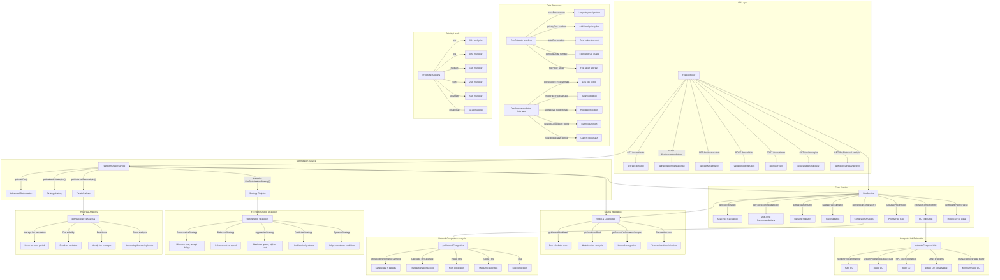

# Fee Mechanism

```mermaid
graph TD
    subgraph "API Layer"
        FC[FeeController]
        FC -->|"GET /fee/estimate"| FCS1["getFeeEstimate()"]
        FC -->|"POST /fee/recommendations"| FCS2["getFeeRecommendations()"]
        FC -->|"GET /fee/market-stats"| FCS3["getFeeMarketStats()"]
        FC -->|"POST /fee/validate"| FCS4["validateFeeEstimate()"]
        FC -->|"POST /fee/optimize"| FCS5["optimizeFee()"]
        FC -->|"GET /fee/strategies"| FCS6["getAvailableStrategies()"]
        FC -->|"GET /fee/historical-analysis"| FCS7["getHistoricalFeeAnalysis()"]
    end

    subgraph "Core Service"
        FS[FeeService]
        FS -->|"getFeeEstimate()"| FS1["Basic Fee Calculation"]
        FS -->|"getFeeRecommendations()"| FS2["Multi-level Recommendations"]
        FS -->|"getFeeMarketStats()"| FS3["Network Statistics"]
        FS -->|"validateFeeEstimate()"| FS4["Fee Validation"]
        FS -->|"estimateComputeUnits()"| FS5["CU Estimation"]
        FS -->|"calculatePriorityFee()"| FS6["Priority Fee Calc"]
        FS -->|"getNetworkCongestion()"| FS7["Congestion Analysis"]
        FS -->|"getRecentPriorityFees()"| FS8["Historical Fee Data"]
    end

    subgraph "Optimization Service"
        FOS[FeeOptimizationService]
        FOS -->|"optimizeFee()"| FOS1["Advanced Optimization"]
        FOS -->|"getAvailableStrategies()"| FOS2["Strategy Listing"]
        FOS -->|"getHistoricalFeeAnalysis()"| FOS3["Trend Analysis"]
        FOS -->|"strategies: FeeOptimizationStrategy[]"| FOS4["Strategy Registry"]
    end

    subgraph "Data Structures"
        FEI["FeeEstimate Interface"]
        FEI -->|"baseFee: number"| FEI1["Lamports per signature"]
        FEI -->|"priorityFee: number"| FEI2["Additional priority fee"]
        FEI -->|"totalFee: number"| FEI3["Total estimated cost"]
        FEI -->|"computeUnits: number"| FEI4["Estimated CU usage"]
        FEI -->|"feePayer: string"| FEI5["Fee payer address"]

        FRI["FeeRecommendation Interface"]
        FRI -->|"conservative: FeeEstimate"| FRI1["Low risk option"]
        FRI -->|"moderate: FeeEstimate"| FRI2["Balanced option"]
        FRI -->|"aggressive: FeeEstimate"| FRI3["High priority option"]
        FRI -->|"networkCongestion: string"| FRI4["low/medium/high"]
        FRI -->|"recentBlockhash: string"| FRI5["Current blockhash"]
    end

    subgraph "Priority Levels"
        PL[PriorityFeeOptions]
        PL -->|"min"| PL1[0.1x multiplier]
        PL -->|"low"| PL2[0.5x multiplier]
        PL -->|"medium"| PL3[1.0x multiplier]
        PL -->|"high"| PL4[2.0x multiplier]
        PL -->|"veryHigh"| PL5[5.0x multiplier]
        PL -->|"unsafeMax"| PL6[10.0x multiplier]
    end

    subgraph "Solana Integration"
        SOL[Web3.js Connection]
        SOL -->|"getRecentBlockhash"| SOL1[Fee calculator data]
        SOL -->|"getConfirmedBlock"| SOL2[Historical fee analysis]
        SOL -->|"getRecentPerformanceSamples"| SOL3[Network congestion]
        SOL -->|"Transaction.from"| SOL4[Transaction deserialization]
    end

    FC --> FS
    FC --> FOS
    FS --> SOL
    FOS --> FS
    FOS --> SOL

    subgraph "Compute Unit Estimation"
        CUE[estimateComputeUnits]
        CUE -->|"SystemProgram.transfer"| CUE1[5000 CU]
        CUE -->|"SystemProgram.createAccount"| CUE2[10000 CU]
        CUE -->|"SPL Token operations"| CUE3[8000 CU]
        CUE -->|"Other programs"| CUE4[10000 CU conservative]
        CUE -->|"Transaction overhead buffer"| CUE5[Minimum 5000 CU]
    end

    FS5 --> CUE

    subgraph "Network Congestion Analysis"
        NCA[getNetworkCongestion]
        NCA -->|"getRecentPerformanceSamples"| NCA1[Sample last 5 periods]
        NCA -->|"Calculate TPS average"| NCA2[Transactions per second]
        NCA -->|">5000 TPS"| NCA3[High congestion]
        NCA -->|">2000 TPS"| NCA4[Medium congestion]
        NCA -->|"Else"| NCA5[Low congestion]
    end

    FS7 --> NCA

    subgraph "Fee Optimization Strategies"
        FOST[Optimization Strategies]
        FOST -->|"ConservativeStrategy"| FOST1[Minimize cost, accept delays]
        FOST -->|"BalancedStrategy"| FOST2[Balance cost vs speed]
        FOST -->|"AggressiveStrategy"| FOST3[Maximize speed, higher cost]
        FOST -->|"PredictiveStrategy"| FOST4[Use historical patterns]
        FOST -->|"DynamicStrategy"| FOST5[Adapt to network conditions]
    end

    FOS4 --> FOST

    subgraph "Historical Analysis"
        HA[getHistoricalFeeAnalysis]
        HA -->|"Average fee calculation"| HA1[Mean fee over period]
        HA -->|"Fee volatility"| HA2[Standard deviation]
        HA -->|"Best times"| HA3[Hourly fee averages]
        HA -->|"Trend analysis"| HA4[increasing/decreasing/stable]
    end

    FOS3 --> HA
```