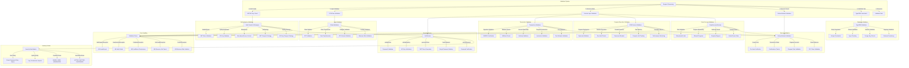

# Consensus and Validation

```mermaid
graph TD
    subgraph "Authentication Validation"
        AUTH[Auth Guards & Strategies]
        AUTH -->|"JwtAuthGuard"| AUTH1[JWT Token Validation]
        AUTH -->|"ApiKeyAuthGuard"| AUTH2[API Key Validation]
        AUTH -->|"RolesGuard"| AUTH3[Role-based Access Control]
        AUTH -->|"JwtStrategy"| AUTH4[JWT Passport Strategy]
        AUTH -->|"ApiKeyStrategy"| AUTH5[API Key Passport Strategy]
    end

    subgraph "Security Service"
        SEC[AuthService]
        SEC -->|"validateUser"| SEC1[Password Validation]
        SEC -->|"validateApiKey"| SEC2[API Key Verification]
        SEC -->|"generateToken"| SEC3[JWT Token Generation]
        SEC -->|"hashPassword"| SEC4[Bcrypt Password Hashing]
        SEC -->|"verifyPassword"| SEC5[Password Verification]
    end

    subgraph "Transaction Validation"
        TV[Transaction Validation]
        TV -->|"Signature Validation"| TV1[Ed25519 Verification]
        TV -->|"Balance Checks"| TV2[Sufficient Funds]
        TV -->|"Account Ownership"| TV3[Authority Validation]
        TV -->|"Program Permissions"| TV4[Instruction Validation]
        TV -->|"Fee Validation"| TV5[Fee Estimate Validation]
    end

    subgraph "Program Execution Validation"
        PEV[SVM Service Validation]
        PEV -->|"Program Deployment"| PEV1[Bytecode Validation]
        PEV -->|"Runtime Execution"| PEV2[Gas Limit Checks]
        PEV -->|"Parallel Execution"| PEV3[Resource Allocation]
        PEV -->|"Gas Metering"| PEV4[Compute Unit Tracking]
        PEV -->|"Execution Metrics"| PEV5[Performance Monitoring]
    end

    subgraph "Smart Account Validation"
        SAV[SmartAccountsService]
        SAV -->|"Rule Validation"| SAV1[Daily Spend Limits]
        SAV -->|"Program Whitelisting"| SAV2[Allowed Programs]
        SAV -->|"Multi-sig Checks"| SAV3[Required Signers]
        SAV -->|"Account Status"| SAV4[Active/Frozen State]
    end

    subgraph "Input Validation"
        IV[Global Validation]
        IV -->|"Class Validator"| IV1[DTO Validation]
        IV -->|"Class Transformer"| IV2[Data Transformation]
        IV -->|"Swagger Validation"| IV3[API Schema Validation]
        IV -->|"Custom Validators"| IV4[Business Rule Validation]
    end

    subgraph "Database Validation"
        DV[TypeORM Validation]
        DV -->|"Entity Constraints"| DV1[Unique Constraints]
        DV -->|"Column Validation"| DV2[Type Checking]
        DV -->|"Relation Validation"| DV3[Foreign Key Checks]
        DV -->|"Migration Validation"| DV4[Schema Consistency]
    end

    subgraph "External Validation"
        EV[Solana Network Validation]
        EV -->|"Account Info"| EV1[On-chain Verification]
        EV -->|"Transaction Status"| EV2[Confirmation Checks]
        EV -->|"Program Accounts"| EV3[Program State Validation]
        EV -->|"Token Balances"| EV4[SPL Token Validation]
    end

    AUTH --> SEC
    TV --> EV
    PEV --> EV
    SAV --> EV

    subgraph "Validation Pipeline"
        VP[Request Processing]
        VP -->|"1. Auth Guards"| VP1[JWT/API Key Check]
        VP -->|"2. Input Validation"| VP2[DTO/Class Validation]
        VP -->|"3. Business Rules"| VP3[Service Layer Validation]
        VP -->|"4. External Checks"| VP4[Solana Network Validation]
        VP -->|"5. Database Ops"| VP5[TypeORM Constraints]
        VP -->|"6. Response"| VP6[Validated Data]
    end

    VP1 --> AUTH
    VP2 --> IV
    VP3 --> SEC
    VP3 --> TV
    VP3 --> PEV
    VP3 --> SAV
    VP4 --> EV
    VP5 --> DV

    subgraph "Error Handling"
        EH[Validation Errors]
        EH -->|"BadRequestException"| EH1[400 Invalid Input]
        EH -->|"UnauthorizedException"| EH2[401 Auth Failed]
        EH -->|"ForbiddenException"| EH3[403 Insufficient Permissions]
        EH -->|"NotFoundException"| EH4[404 Resource Not Found]
        EH -->|"ConflictException"| EH5[409 Business Rule Violation]
    end

    subgraph "Security Entities"
        SE[Security Data Models]
        SE -->|"User Entity"| SE1[Email, Password, Role, Status]
        SE -->|"ApiKey Entity"| SE2[Key, Permissions, Expires]
        SE -->|"UserRole Enum"| SE3[ADMIN, USER, MODERATOR]
        SE -->|"UserStatus Enum"| SE4[ACTIVE, INACTIVE, SUSPENDED]
    end

    SEC --> SE
    AUTH --> EH
    IV --> EH
    TV --> EH
    PEV --> EH
    SAV --> EH
```
