# Signing and Cryptography

```mermaid
graph TD
    subgraph "API Layer"
        SC[SigningController]
        SC -->|"POST /signing/generate-keypair"| SC1["generateKeyPair()"]
        SC -->|"POST /signing/sign-message"| SC2["signMessage()"]
        SC -->|"POST /signing/verify-signature"| SC3["verifySignature()"]
        SC -->|"POST /signing/create-transfer"| SC4["createAndSignTransfer()"]
        SC -->|"POST /signing/get-public-key"| SC5["getPublicKeyFromPrivateKey()"]
    end

    subgraph "Service Layer"
        SS[SigningService]
        SS -->|"generateKeyPair()"| SS1["Ed25519 Key Generation"]
        SS -->|"signMessage()"| SS2["Message Signing"]
        SS -->|"verifySignature()"| SS3["Signature Verification"]
        SS -->|"signAndSendTransaction()"| SS4["Transaction Signing"]
        SS -->|"createAndSignTransfer()"| SS5["Transfer Creation"]
        SS -->|"getPublicKeyFromPrivateKey()"| SS6["Public Key Extraction"]
        SS -->|"loadKeyPairFromPrivateKey()"| SS7["Key Loading"]
    end

    subgraph "Cryptographic Libraries"
        TWN[tweetnacl]
        TWN -->|"sign.detached()"| TWN1["Ed25519 Signing"]
        TWN -->|"sign.detached.verify()"| TWN2["Signature Verification"]
    end

    subgraph "Solana Integration"
        SOL["Web3.js"]
        SOL -->|"Keypair.generate()"| SOL1["Keypair Creation"]
        SOL -->|"Keypair.fromSecretKey()"| SOL2["Key Loading"]
        SOL -->|"Transaction.sign()"| SOL3["Transaction Signing"]
        SOL -->|"sendAndConfirmTransaction()"| SOL4["Transaction Submission"]
        SOL -->|"SystemProgram.transfer()"| SOL5["Transfer Instructions"]
        SOL -->|"PublicKey"| SOL6["Address Handling"]
    end

    subgraph "Data Structures"
        KPR[KeyPairResponse]
        KPR -->|"publicKey: string"| KPR1["Public Key Only"]
        KPR -->|"// private key NEVER returned"| KPR2["Security Practice"]

        SGR[SigningResult]
        SGR -->|"signature: string"| SGR1["Base64 Signature"]
        SGR -->|"publicKey: string"| SGR2["Signer Public Key"]
        SGR -->|"success: boolean"| SGR3["Operation Status"]

        VFR[VerificationResult]
        VFR -->|"isValid: boolean"| VFR1["Verification Status"]
        VFR -->|"publicKey: string"| VFR2["Expected Public Key"]
        VFR -->|"message: string"| VFR3["Result Message"]
    end

    subgraph "Database Integration"
        DB[(PostgreSQL)]
        DB -->|"Transaction Entity"| DB1["Signature Recording"]
        DB -->|"TypeORM Repository"| DB2["Transaction Persistence"]
    end

    SC --> SS
    SC --> TWN
    SC --> SOL
    SC --> DB

    subgraph "Key Management"
        KM["Security Practices"]
        KM -->|"Private Key Format"| KM1["JSON Array of Numbers"]
        KM -->|"Key Loading"| KM2["Uint8Array Conversion"]
        KM -->|"Error Handling"| KM3[BadRequestException]
        KM -->|"No Private Key Exposure"| KM4["Security Principle"]
    end

    SS7 --> KM

    subgraph "Transaction Flow"
        TF["Signing Workflow"]
        TF -->|"1. Load Keypair"| TF1["Private Key to Keypair"]
        TF -->|"2. Build Transaction"| TF2["Instruction Assembly"]
        TF -->|"3. Sign Transaction"| TF3["Ed25519 Signing"]
        TF -->|"4. Submit to Network"| TF4[sendAndConfirmTransaction]
        TF -->|"5. Record Transaction"| TF5["Database Persistence"]
    end

    SS4 --> TF

    subgraph "Message Signing Flow"
        MSF["Message Signing"]
        MSF -->|"1. Decode Message"| MSF1["Base64 to Uint8Array"]
        MSF -->|"2. Load Private Key"| MSF2["Keypair Creation"]
        MSF -->|"3. Sign with Ed25519"| MSF3["tweetnacl signing"]
        MSF -->|"4. Return Signature"| MSF4["Base64 Encoding"]
    end

    SS2 --> MSF

    subgraph "Signature Verification Flow"
        SVF["Verification Process"]
        SVF -->|"1. Decode Inputs"| SVF1["Base64 to Bytes"]
        SVF -->|"2. Load Public Key"| SVF2["PublicKey Object"]
        SVF -->|"3. Verify with Ed25519"| SVF3["tweetnacl verify"]
        SVF -->|"4. Return Result"| SVF4["Boolean + Message"]
    end

    SS3 --> SVF

    subgraph "Security Considerations"
        SEC["Implemented Security"]
        SEC -->|"Private Key Never Returned"| SEC1["API Security"]
        SEC -->|"Base64 Message Encoding"| SEC2["Safe Transport"]
        SEC -->|"Error Message Sanitization"| SEC3["Information Leakage Prevention"]
        SEC -->|"Transaction Recording"| SEC4["Audit Trail"]
        SEC -->|"Input Validation"| SEC5["BadRequestException Handling"]
    end
```

    subgraph "MPC Implementation"
        MPC1["Key Share Distribution"]
        MPC2["Threshold Signing"]
        MPC3["Secure Key Reconstruction"]
        MPC4["Byzantine Fault Tolerance"]
    end
