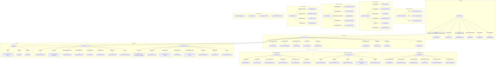

# Multi-Party Computation (MPC)

```mermaid
graph TD
    subgraph "API Layer"
        MC[MpcController]
        MC -->|"POST /mpc/wallets"| MC1[createMpcWallet]
        MC -->|"GET /mpc/wallets"| MC2[getMpcWallets]
        MC -->|"GET /mpc/wallets/:walletId"| MC3[getMpcWallet]
        MC -->|"GET /mpc/wallets/:walletId/shares"| MC4[getWalletKeyShares]
        MC -->|"POST /mpc/sign"| MC5[signTransaction]
        MC -->|"DELETE /mpc/wallets/:walletId/shares/:participantId/:shareIndex"| MC6[revokeKeyShare]
    end

    subgraph "Service Layer"
        MS[MpcService]
        MS -->|"createMpcWallet"| MS1[Wallet Creation]
        MS -->|"getMpcWallets"| MS2[Wallet Listing]
        MS -->|"getMpcWallet"| MS3[Wallet Retrieval]
        MS -->|"getWalletKeyShares"| MS4[Share Distribution]
        MS -->|"signTransaction"| MS5[Threshold Signing]
        MS -->|"revokeKeyShare"| MS6[Share Revocation]
        MS -->|"generateDistributedKey"| MS7[DKG Simulation]
        MS -->|"reconstructSignature"| MS8[Signature Reconstruction]
        MS -->|"validateParticipantShares"| MS9[Share Validation]
    end

    subgraph "Data Layer"
        MWE[MpcWallet Entity]
        MWE -->|"id: string"| MWE1[PrimaryGeneratedColumn]
        MWE -->|"walletId: string"| MWE2[Unique Public ID]
        MWE -->|"name: string"| MWE3[Human Readable Name]
        MWE -->|"thresholdScheme: enum"| MWE4[TSS_2_3, TSS_3_5, TSS_4_7]
        MWE -->|"totalShares: number"| MWE5[Total Key Shares]
        MWE -->|"threshold: number"| MWE6[Minimum Shares for Signing]
        MWE -->|"publicKey: text"| MWE7[Combined Public Key]
        MWE -->|"status: enum"| MWE8[CREATING, ACTIVE, RECOVERING, DISABLED]

        KSE[KeyShare Entity]
        KSE -->|"id: string"| KSE1[PrimaryGeneratedColumn]
        KSE -->|"walletId: string"| KSE2[Foreign Key to Wallet]
        KSE -->|"participantId: string"| KSE3[Participant Identifier]
        KSE -->|"shareIndex: number"| KSE4[Share Position]
        KSE -->|"encryptedShare: text"| KSE5[Encrypted Key Share]
        KSE -->|"participantPublicKey: string"| KSE6[Participant Public Key]
        KSE -->|"status: enum"| KSE7[ACTIVE, REVOKED, RECOVERING]
        KSE -->|"type: enum"| KSE8[ORIGINAL, RECOVERY]
    end

    subgraph "Threshold Schemes"
        TS[Implemented Schemes]
        TS -->|"2-of-3"| TS1[2 shares needed, 3 total]
        TS -->|"3-of-5"| TS2[3 shares needed, 5 total]
        TS -->|"4-of-7"| TS3[4 shares needed, 7 total]
    end

    subgraph "Database"
        DB[(PostgreSQL)]
        DB -->|"TypeORM"| DB1["Repository<MpcWallet>"]
        DB -->|"TypeORM"| DB2["Repository<KeyShare>"]
        DB -->|"Relations"| DB3["One-to-Many: Wallet->Shares"]
    end

    MC --> MS
    MS --> MWE
    MS --> KSE
    MS --> DB

    subgraph "Wallet Creation Flow"
        WCF[createMpcWallet]
        WCF -->|"1. Validate Participants"| WCF1[Minimum 2 participants]
        WCF -->|"2. Determine Threshold"| WCF2[Scheme-based parameters]
        WCF -->|"3. Generate Distributed Key"| WCF3[DKG simulation]
        WCF -->|"4. Create Wallet Entity"| WCF4[Database persistence]
        WCF -->|"5. Create Key Shares"| WCF5[Encrypted share storage]
        WCF -->|"6. Return Wallet Response"| WCF6[Public wallet data]
    end

    MS1 --> WCF

    subgraph "Threshold Signing Flow"
        TSF[signTransaction]
        TSF -->|"1. Load Wallet"| TSF1[Verify active status]
        TSF -->|"2. Validate Share Count"| TSF2[Check threshold met]
        TSF -->|"3. Validate Shares"| TSF3[Participant authentication]
        TSF -->|"4. Reconstruct Signature"| TSF4[Combine partial signatures]
        TSF -->|"5. Update Usage"| TSF5[Track share usage]
        TSF -->|"6. Return Result"| TSF6[Complete signature]
    end

    MS5 --> TSF

    subgraph "Key Share Management"
        KSM[Share Operations]
        KSM -->|"Distribution"| KSM1[Participant-specific access]
        KSM -->|"Revocation"| KSM2[Security compromise response]
        KSM -->|"Recovery"| KSM3[Backup share generation]
        KSM -->|"Encryption"| KSM4[AES-256 encryption at rest]
        KSM -->|"Validation"| KSM5[Participant authentication]
    end

    MS4 --> KSM
    MS6 --> KSM

    subgraph "Security Features"
        SEC[Implemented Security]
        SEC -->|"Encrypted Shares"| SEC1[AES encryption]
        SEC -->|"Participant Auth"| SEC2[Public key verification]
        SEC -->|"Threshold Security"| SEC3[t-of-n signing]
        SEC -->|"Share Revocation"| SEC4[Compromise response]
        SEC -->|"Audit Trail"| SEC5[Usage tracking]
        SEC -->|"Status Management"| SEC6[Active/Disabled states]
    end

    subgraph "Response Structures"
        RS[API Responses]
        RS -->|"MpcWalletResponse"| RS1[Wallet with share counts]
        RS -->|"KeyShareResponse"| RS2[Share metadata only]
        RS -->|"SignatureReconstructionResult"| RS3[Signing outcome]
        RS -->|"canSign: boolean"| RS4[Threshold check result]
        RS -->|"activeShares: number"| RS5[Current active shares]
    end

    subgraph "Error Handling"
        EH[Validation Errors]
        EH -->|"BadRequestException"| EH1[Invalid parameters]
        EH -->|"NotFoundException"| EH2[Wallet/share not found]
        EH -->|"Insufficient shares"| EH3[Threshold not met]
        EH -->|"Invalid participants"| EH4[Authentication failed]
    end

    subgraph "Integration Flow"
        IF1[Threshold Cryptography]
        IF2[Key Generation]
        IF3[Signature Creation]
        IF4[Signature Reconstruction]
    end

    IF1 --> IF2
    IF2 --> IF3
    IF3 --> IF4
```