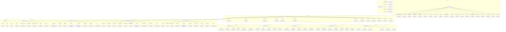

# Solana Virtual Machine (SVM)

```mermaid
graph TD
    subgraph "API Layer"
        SC[SvmController]
        SC -->|"POST /svm/programs"| SC1[createProgram]
        SC -->|"GET /svm/programs/:id"| SC2[getProgram]
        SC -->|"GET /svm/programs"| SC3[queryPrograms]
        SC -->|"PUT /svm/programs/:id"| SC4[updateProgram]
        SC -->|"DELETE /svm/programs/:id"| SC5[deleteProgram]
        SC -->|"POST /svm/programs/:id/deploy"| SC6[deployProgram]
        SC -->|"POST /svm/execute"| SC7[executeProgram]
        SC -->|"POST /svm/execute/parallel"| SC8[executeParallel]
        SC -->|"GET /svm/executions/:id"| SC9[getExecution]
        SC -->|"GET /svm/executions"| SC10[queryExecutions]
        SC -->|"GET /svm/metrics/executions"| SC11[getExecutionMetrics]
        SC -->|"POST /svm/gas-meters"| SC12[createGasMeter]
        SC -->|"GET /svm/gas-meters/:id"| SC13[getGasMeter]
        SC -->|"GET /svm/gas-meters"| SC14[queryGasMeters]
        SC -->|"PUT /svm/gas-meters/:id"| SC15[updateGasMeter]
        SC -->|"DELETE /svm/gas-meters/:id"| SC16[deleteGasMeter]
        SC -->|"POST /svm/gas-meters/:id/consume"| SC17[consumeGas]
        SC -->|"POST /svm/gas-meters/:id/reset"| SC18[resetGasMeter]
        SC -->|"GET /svm/runtime/info"| SC19[getRuntimeInfo]
        SC -->|"GET /svm/programs/:programId/stats"| SC20[getProgramStats]
    end

    subgraph "Service Layer"
        SS[SvmService]
        SS -->|"createProgram()"| SS1["Program Creation"]
        SS -->|"getProgram()"| SS2["Program Retrieval"]
        SS -->|"queryPrograms()"| SS3["Program Querying"]
        SS -->|"updateProgram()"| SS4["Program Updates"]
        SS -->|"deleteProgram()"| SS5["Program Deletion"]
        SS -->|"deployProgram()"| SS6["Program Deployment"]
        SS -->|"executeProgram()"| SS7["Single Execution"]
        SS -->|"executeParallel()"| SS8["Parallel Execution"]
        SS -->|"getExecution()"| SS9["Execution Retrieval"]
        SS -->|"queryExecutions()"| SS10["Execution Querying"]
        SS -->|"getExecutionMetrics()"| SS11["Metrics Aggregation"]
        SS -->|"checkGasMeter()"| SS12["Gas Validation"]
        SS -->|"consumeGas()"| SS13["Gas Consumption"]
    end

    subgraph "Data Layer"
        PE["Program Entity"]
        PE -->|"id: string"| PE1[PrimaryGeneratedColumn]
        PE -->|"programId: string"| PE2["Solana Program ID"]
        PE -->|"name: string"| PE3["Program Name"]
        PE -->|"description: text"| PE4["Program Description"]
        PE -->|"programType: enum"| PE5["NATIVE, BPF, etc."]
        PE -->|"status: enum"| PE6["DEPLOYING, ACTIVE, SUSPENDED"]
        PE -->|"bytecode: text"| PE7["Base64 Encoded"]
        PE -->|"sizeBytes: number"| PE8["Bytecode Size"]
        PE -->|"maxComputeUnits: number"| PE9["CU Limit"]
        PE -->|"owner: string"| PE10["Owner Address"]

        REE["RuntimeExecution Entity"]
        REE -->|"id: string"| REE1[PrimaryGeneratedColumn]
        REE -->|"programId: string"| REE2["Executed Program"]
        REE -->|"executionType: enum"| REE3["INSTRUCTION, PARALLEL"]
        REE -->|"status: enum"| REE4["RUNNING, SUCCESS, FAILED"]
        REE -->|"computeUnitsAllocated: number"| REE5["CU Allocated"]
        REE -->|"computeUnitsUsed: number"| REE6["CU Actually Used"]
        REE -->|"executionTimeMs: number"| REE7["Execution Duration"]
        REE -->|"gasCost: number"| REE8["Gas Cost in SOL"]
        REE -->|"transactionId: string"| REE9["Solana Signature"]
        REE -->|"slotNumber: number"| REE10["Execution Slot"]

        GME["GasMeter Entity"]
        GME -->|"id: string"| GME1[PrimaryGeneratedColumn]
        GME -->|"programId: string"| GME2["Associated Program"]
        GME -->|"accountId: string"| GME3["Associated Account"]
        GME -->|"meterType: enum"| GME4["INSTRUCTION, PROGRAM, etc."]
        GME -->|"status: enum"| GME5["ACTIVE, PAUSED, EXCEEDED"]
        GME -->|"gasLimit: bigint"| GME6["Maximum Gas"]
        GME -->|"gasUsed: bigint"| GME7["Current Usage"]
        GME -->|"resetPeriod: enum"| GME8["DAILY, WEEKLY, MONTHLY"]
    end

    subgraph "Solana Integration"
        SOL["Web3.js Connection"]
        SOL -->|"PublicKey"| SOL1["Address Handling"]
        SOL -->|"Transaction"| SOL2["Transaction Building"]
        SOL -->|"SystemProgram.createAccount"| SOL3["Program Deployment"]
        SOL -->|"ComputeBudgetProgram"| SOL4["CU Management"]
        SOL -->|"sendAndConfirmTransaction"| SOL5["Transaction Submission"]
        SOL -->|"getSlot()"| SOL6["Slot Tracking"]
    end

    subgraph "Database"
        DB[(PostgreSQL)]
        DB -->|"TypeORM"| DB1["Repository<Program>"]
        DB -->|"TypeORM"| DB2["Repository<RuntimeExecution>"]
        DB -->|"TypeORM"| DB3["Repository<GasMeter>"]
    end

    SC --> SS
    SS --> PE
    SS --> REE
    SS --> GME
    SS --> SOL
    SS --> DB

    subgraph "Program Lifecycle"
        PLC[Program Management]
        PLC -->|"Create"| PLC1[Metadata Storage]
        PLC -->|"Deploy"| PLC2[On-chain Deployment]
        PLC -->|"Execute"| PLC3[Runtime Execution]
        PLC -->|"Monitor"| PLC4[Metrics Collection]
        PLC -->|"Update"| PLC5[Program Upgrades]
        PLC -->|"Delete"| PLC6[Program Removal]
    end

    SS1 --> PLC
    SS6 --> PLC
    SS7 --> PLC

    subgraph "Execution Engine"
        EE[Runtime Execution]
        EE -->|"Single Execution"| EE1[executeProgram]
        EE -->|"Parallel Execution"| EE2[executeParallel]
        EE -->|"Gas Checking"| EE3[checkGasMeter]
        EE -->|"CU Allocation"| EE4[setComputeUnitLimit]
        EE -->|"Priority Setting"| EE5[setComputeUnitPrice]
        EE -->|"Transaction Building"| EE6[Instruction Assembly]
        EE -->|"Result Tracking"| EE7[Execution Metrics]
    end

    SS7 --> EE
    SS8 --> EE

    subgraph "Gas Management"
        GM[Gas Metering]
        GM -->|"Limit Checking"| GM1[Pre-execution validation]
        GM -->|"Usage Tracking"| GM2[Post-execution accounting]
        GM -->|"Quota Enforcement"| GM3[Hard limits]
        GM -->|"Reset Scheduling"| GM4[Periodic resets]
        GM -->|"Cost Calculation"| GM5[CU to SOL conversion]
        GM -->|"Billing"| GM6[Usage-based charging]
    end

    SS12 --> GM
    SS13 --> GM

    subgraph "Parallel Processing"
        PP[Parallel Execution]
        PP -->|"Promise.allSettled"| PP1[Concurrent processing]
        PP -->|"Error Isolation"| PP2[Failure containment]
        PP -->|"Resource Limits"| PP3[Total CU validation]
        PP -->|"Result Aggregation"| PP4[Combined responses]
        PP -->|"Partial Success"| PP5[continueOnFailure option]
    end

    SS8 --> PP

    subgraph "Metrics & Monitoring"
        MM[Execution Analytics]
        MM -->|"Performance Tracking"| MM1[Execution time]
        MM -->|"Resource Usage"| MM2[CU consumption]
        MM -->|"Success Rates"| MM3[Execution outcomes]
        MM -->|"Cost Analysis"| MM4[Gas expenditure]
        MM -->|"Trend Analysis"| MM5[Historical patterns]
    end

    SS11 --> MM

    subgraph "Security & Validation"
        SV[Execution Security]
        SV -->|"Program Verification"| SV1[Bytecode validation]
        SV -->|"Access Control"| SV2[Owner permissions]
        SV -->|"Gas Limits"| SV3[Resource bounds]
        SV -->|"Account Validation"| SV4[Address verification]
        SV -->|"Error Isolation"| SV5[Failure containment]
    end
```