# Cross-Program Invocations (CPIs)

```mermaid
graph TD
    subgraph "API Layer"
        CC[CpiController]
        CC -->|"POST /cpi/instructions"| CC1["createInstruction()"]
        CC -->|"GET /cpi/instructions/:programId"| CC2["getInstructionsByProgram()"]
        CC -->|"POST /cpi/permissions"| CC3["createPermission()"]
        CC -->|"PUT /cpi/permissions/:id"| CC4["updatePermission()"]
        CC -->|"POST /cpi/execute"| CC5["executeCpi()"]
        CC -->|"GET /cpi/history"| CC6["getInvocationHistory()"]
        CC -->|"POST /cpi/check-permission"| CC8["checkPermission()"]
        CC -->|"POST /cpi/dex/swap"| CC7["performDexSwap()"]
        CC -->|"GET /cpi/dex/history"| CC9["getDexHistory()"]
    end

    subgraph "Service Layer"
        CS[CpiService]
        CS -->|"createInstruction()"| CS1["Instruction Template Creation"]
        CS -->|"getInstructionsByProgram()"| CS2["Instruction Retrieval"]
        CS -->|"createPermission()"| CS3["Permission Granting"]
        CS -->|"updatePermission()"| CS4["Permission Updates"]
        CS -->|"checkPermission()"| CS5["Permission Validation"]
        CS -->|"executeCpi()"| CS6["CPI Execution"]
        CS -->|"getInvocationHistory()"| CS7["Invocation History"]
    end

    subgraph "DEX Service"
        DS[DexService]
        DS -->|"executeSwap()"| DS1["Token Swap Execution"]
        DS -->|"getQuote()"| DS2["Price Quotation"]
        DS -->|"getPools()"| DS3["Liquidity Pool Info"]
    end

    subgraph "Data Layer"
        CIE["CpiInstruction Entity"]
        CIE -->|"id: string"| CIE1[PrimaryGeneratedColumn]
        CIE -->|"programId: string"| CIE2["Target Program ID"]
        CIE -->|"callerProgramId: string"| CIE3["Caller Program ID"]
        CIE -->|"instructionData: jsonb"| CIE4["Instruction Payload"]
        CIE -->|"accounts: jsonb"| CIE5["Account Metadata Array"]
        CIE -->|"methodName: string"| CIE6["Method Identifier"]
        CIE -->|"requiresPermission: boolean"| CIE7["Permission Required"]
        CIE -->|"permissionLevel: string"| CIE8["Permission Type"]
        CIE -->|"isActive: boolean"| CIE9["Active Status"]

        CPE["CpiPermission Entity"]
        CPE -->|"id: string"| CPE1[PrimaryGeneratedColumn]
        CPE -->|"programId: string"| CPE2["Target Program"]
        CPE -->|"granterProgramId: string"| CPE3["Permission Granter"]
        CPE -->|"permissionType: string"| CPE4["Permission Type"]
        CPE -->|"accountId: string"| CPE5["Specific Account"]
        CPE -->|"expiresAt: timestamp"| CPE6["Expiration Date"]
        CPE -->|"isActive: boolean"| CPE7["Active Status"]

        CIV["CpiInvocation Entity"]
        CIV -->|"id: string"| CIV1[PrimaryGeneratedColumn]
        CIV -->|"callerProgramId: string"| CIV2["Calling Program"]
        CIV -->|"targetProgramId: string"| CIV3["Target Program"]
        CIV -->|"instructionName: string"| CIV4["Instruction Method"]
        CIV -->|"instructionData: jsonb"| CIV5["Call Payload"]
        CIV -->|"accounts: jsonb"| CIV6["Account Metadata"]
        CIV -->|"status: string"| CIV7["Execution Status"]
        CIV -->|"transactionId: string"| CIV8["Solana Signature"]
        CIV -->|"gasUsed: number"| CIV9["Compute Units Used"]
        CIV -->|"errorMessage: string"| CIV10["Error Details"]
    end

    subgraph "SVM Integration"
        SVM[SvmService]
        SVM -->|"executeProgram()"| SVM1["CPI Execution"]
        SVM -->|"Program Deployment"| SVM2["Target Program Loading"]
    end

    subgraph "Database"
        DB[(PostgreSQL)]
        DB -->|"TypeORM"| DB1["Repository<CpiInstruction>"]
        DB -->|"TypeORM"| DB2["Repository<CpiPermission>"]
        DB -->|"TypeORM"| DB3["Repository<CpiInvocation>"]
        DB -->|"Relations"| DB4["Many-to-One with Program"]
    end

    CC --> CS
    CC --> DS
    CS --> CIE
    CS --> CPE
    CS --> CIV
    CS --> SVM
    CS --> DB
    DS --> CS

    subgraph "Permission System"
        PS["Access Control"]
        PS -->|"Permission Creation"| PS1["createPermission()"]
        PS -->|"Permission Checking"| PS2["checkPermission()"]
        PS -->|"Expiration Handling"| PS3["Time-based revocation"]
        PS -->|"Granular Control"| PS4["Program + account level"]
        PS -->|"Dynamic Updates"| PS5["Permission modification"]
    end

    CS3 --> PS
    CS5 --> PS

    subgraph "Instruction Templates"
        IT["Template Management"]
        IT -->|"Template Creation"| IT1["createInstruction()"]
        IT -->|"Template Retrieval"| IT2["getInstructionsByProgram()"]
        IT -->|"Permission Binding"| IT3["requiresPermission flag"]
        IT -->|"Account Metadata"| IT4["Structured account info"]
        IT -->|"Method Mapping"| IT5["methodName identification"]
    end

    CS1 --> IT
    CS2 --> IT

    subgraph "CPI Execution Flow"
        CEF["CPI Invocation"]
        CEF -->|"Permission Check"| CEF1["Validate access rights"]
        CEF -->|"Invocation Record"| CEF2["Create tracking entry"]
        CEF -->|"SVM Execution"| CEF3["executeProgram() call"]
        CEF -->|"Result Tracking"| CEF4["Update invocation status"]
        CEF -->|"Error Handling"| CEF5["Failure recording"]
    end

    CS6 --> CEF

    subgraph "DEX Operations"
        DO["Decentralized Exchange"]
        DO -->|"Token Swaps"| DO1["executeSwap()"]
        DO -->|"Price Quotes"| DO2["getQuote()"]
        DO -->|"Liquidity Pools"| DO3["getPools()"]
        DO -->|"Multi-hop Swaps"| DO4["Complex routing"]
        DO -->|"Slippage Protection"| DO5["Price impact limits"]
    end

    DS --> DO

    subgraph "Security Features"
        SF["CPI Security"]
        SF -->|"Permission Validation"| SF1["Access control enforcement"]
        SF -->|"Account Verification"| SF2["Address validation"]
        SF -->|"Execution Isolation"| SF3["Failure containment"]
        SF -->|"Audit Trail"| SF4["Invocation logging"]
        SF -->|"Gas Metering"| SF5["Resource usage tracking"]
    end

    subgraph "Common CPI Patterns"
        CPP["Implementation Patterns"]
        CPP -->|"Token Transfers"| CPP1["SPL Token CPI calls"]
        CPP -->|"Account Creation"| CPP2["System Program invocation"]
        CPP -->|"Metadata Updates"| CPP3["Token Metadata Program"]
        CPP -->|"DEX Swaps"| CPP4["Liquidity pool interactions"]
        CPP -->|"Staking Operations"| CPP5["Stake Program calls"]
        CPP -->|"NFT Minting"| CPP6["Metaplex Program usage"]
    end
```

        I2[invoke_signed]
        I2 --> I2A["PDA Signing"]
        I3[invoke_signed_unchecked]
        I3 --> I3A["Advanced Usage"]
    end

    subgraph "Program Composition"
        PC1["Protocol Stacks"]
        PC2["Modular Design"]
        PC3["Reusable Components"]
        PC4[Interoperability]
    end
