# Events and Logging

```mermaid
graph TD
    subgraph "API Layer"
        EC[EventsController]
        EC -->|"POST /events"| EC1["createEvent()"]
        EC -->|"GET /events"| EC2["getEvents()"]
        EC -->|"PUT /events/:id"| EC3["updateEvent()"]
        EC -->|"GET /events/replay"| EC4["getEventsForReplay()"]
        EC -->|"POST /events/subscriptions"| EC5["createSubscription()"]
        EC -->|"GET /events/subscriptions/:clientId"| EC6["getSubscriptionsByClient()"]
        EC -->|"PUT /events/subscriptions/:id"| EC7["updateSubscription()"]
        EC -->|"DELETE /events/subscriptions/:id"| EC8["deleteSubscription()"]
        EC -->|"POST /events/filters"| EC9["createFilter()"]
        EC -->|"GET /events/filters/:ownerId"| EC10["getFiltersByOwner()"]
        EC -->|"GET /events/filters/public/all"| EC13["getPublicFilters()"]
        EC -->|"PUT /events/filters/:id"| EC14["updateFilter()"]
        EC -->|"DELETE /events/filters/:id"| EC15["deleteFilter()"]
        EC -->|"POST /events/monitor/account/:accountId"| EC11["subscribeToAccount()"]
        EC -->|"DELETE /events/monitor/account/:accountId"| EC16["unsubscribeFromAccount()"]
        EC -->|"POST /events/monitor/program/:programId"| EC17["subscribeToProgramAccounts()"]
        EC -->|"GET /events/stats"| EC12["getEventStats()"]
    end

    subgraph "Service Layer"
        ES[EventsService]
        ES -->|"createEvent()"| ES1["Event Creation"]
        ES -->|"getEvents()"| ES2["Event Querying"]
        ES -->|"updateEvent()"| ES3["Event Updates"]
        ES -->|"getEventsSince()"| ES4["Temporal Queries"]
        ES -->|"startBlockchainMonitoring()"| ES5["Blockchain Monitoring"]
        ES -->|"handleProgramLogs()"| ES6["Log Processing"]
        ES -->|"handleSlotUpdate()"| ES7["Slot Monitoring"]
        ES -->|"handleAccountChange()"| ES8["Account Monitoring"]
    end

    subgraph "WebSocket Gateway"
        EG[EventsGateway]
        EG -->|"handleConnection()"| EG1["Client Connection"]
        EG -->|"handleDisconnect()"| EG2["Client Disconnection"]
        EG -->|"@SubscribeMessage subscribe"| EG3["Event Subscription"]
        EG -->|"@SubscribeMessage unsubscribe"| EG4["Event Unsubscription"]
        EG -->|"emitEvent()"| EG5["Event Broadcasting"]
        EG -->|"server.to()"| EG6["Targeted Emission"]
    end

    subgraph "Subscription Service"
        ESS[EventSubscriptionService]
        ESS -->|"createSubscription()"| ESS1["Subscription Creation"]
        ESS -->|"getSubscriptions()"| ESS2["Subscription Retrieval"]
        ESS -->|"updateSubscription()"| ESS3["Subscription Updates"]
        ESS -->|"deleteSubscription()"| ESS4["Subscription Removal"]
        ESS -->|"notifySubscribers()"| ESS5["Event Notification"]
    end

    subgraph "Filter Service"
        EFS[EventFilterService]
        EFS -->|"createFilter()"| EFS1["Filter Creation"]
        EFS -->|"getFilters()"| EFS2["Filter Retrieval"]
        EFS -->|"applyFilters()"| EFS3["Event Filtering"]
        EFS -->|"matchesFilter()"| EFS4["Filter Matching"]
    end

    subgraph "Data Layer"
        EE["Event Entity"]
        EE -->|"id: string"| EE1[PrimaryGeneratedColumn]
        EE -->|"eventType: EventType"| EE2["TRANSACTION_CONFIRMED, etc."]
        EE -->|"source: string"| EE3["Account/Program ID"]
        EE -->|"data: jsonb"| EE4["Event Payload"]
        EE -->|"slot: bigint"| EE5["Solana Slot Number"]
        EE -->|"signature: string"| EE6["Transaction Signature"]
        EE -->|"status: EventStatus"| EE7["PENDING, PROCESSED, FAILED"]

        ESE["EventSubscription Entity"]
        ESE -->|"id: string"| ESE1[PrimaryGeneratedColumn]
        ESE -->|"clientId: string"| ESE2["WebSocket Client ID"]
        ESE -->|"eventTypes: string[]"| ESE3["Subscribed Event Types"]
        ESE -->|"filters: jsonb"| ESE4["Subscription Filters"]
        ESE -->|"isActive: boolean"| ESE5["Active Status"]
        ESE -->|"webhookUrl: string"| ESE6["Webhook Endpoint"]

        EFE["EventFilter Entity"]
        EFE -->|"id: string"| EFE1[PrimaryGeneratedColumn]
        EFE -->|"name: string"| EFE2["Filter Name"]
        EFE -->|"eventType: EventType"| EFE3["Target Event Type"]
        EFE -->|"conditions: jsonb"| EFE4["Filter Conditions"]
        EFE -->|"action: string"| EFE5["Filter Action"]
        EFE -->|"isActive: boolean"| EFE6["Active Status"]
    end

    subgraph "Solana Integration"
        SOL["Web3.js Connection"]
        SOL -->|"onLogs()"| SOL1["Program Log Monitoring"]
        SOL -->|"onSlotUpdate()"| SOL2["Slot Update Monitoring"]
        SOL -->|"onAccountChange()"| SOL3["Account Change Monitoring"]
        SOL -->|"onProgramAccountChange()"| SOL4["Program Account Monitoring"]
    end

    subgraph "WebSocket Server"
        WS[(Socket.IO)]
        WS -->|"Namespace: /events"| WS1["Event Namespace"]
        WS -->|"Rooms: client:{id}"| WS2["Client-specific Rooms"]
        WS -->|"Real-time Events"| WS3["Live Event Streaming"]
        WS -->|"Connection Management"| WS4["Client Lifecycle"]
    end

    subgraph "Database"
        DB[(PostgreSQL)]
        DB -->|"TypeORM"| DB1["Repository<Event>"]
        DB -->|"TypeORM"| DB2["Repository<EventSubscription>"]
        DB -->|"TypeORM"| DB3["Repository<EventFilter>"]
        DB -->|"Indexes"| DB4["eventType, source, createdAt"]
    end

    EC --> ES
    EC --> ESS
    EC --> EFS
    ES --> EE
    ES --> EG
    ES --> SOL
    ES --> DB
    EG --> WS
    ESS --> ESE
    ESS --> EG
    EFS --> EFE

    subgraph "Event Types"
        ET["Supported Events"]
        ET -->|"TRANSACTION_CONFIRMED"| ET1["Tx Confirmation"]
        ET -->|"ACCOUNT_CHANGED"| ET2["Account Updates"]
        ET -->|"PROGRAM_LOG"| ET3["Program Logs"]
        ET -->|"CPI_INVOCATION"| ET4["Cross-Program Calls"]
        ET -->|"BLOCK_PRODUCED"| ET5["Block Production"]
        ET -->|"SLOT_UPDATED"| ET6["Slot Updates"]
    end

    subgraph "Blockchain Monitoring"
        BM["Real-time Monitoring"]
        BM -->|"Log Subscriptions"| BM1["onLogs('all')"]
        BM -->|"Slot Updates"| BM2["onSlotUpdate()"]
        BM -->|"Account Changes"| BM3["onAccountChange()"]
        BM -->|"Program Changes"| BM4["onProgramAccountChange()"]
        BM -->|"Subscription Management"| BM5["Map-based Tracking"]
    end

    ES5 --> BM

    subgraph "Event Processing Pipeline"
        EPP["Event Flow"]
        EPP -->|"Event Detection"| EPP1["Blockchain Monitoring"]
        EPP -->|"Event Creation"| EPP2["createEvent()"]
        EPP -->|"Database Storage"| EPP3["Persistent Storage"]
        EPP -->|"WebSocket Emission"| EPP4["Real-time Broadcasting"]
        EPP -->|"Subscription Filtering"| EPP5["Targeted Delivery"]
        EPP -->|"Webhook Delivery"| EPP6["HTTP Callbacks"]
    end

    ES1 --> EPP

    subgraph "Subscription Management"
        SM["Client Subscriptions"]
        SM -->|"WebSocket Subscription"| SM1["Real-time Streaming"]
        SM -->|"Webhook Subscription"| SM2["HTTP Callbacks"]
        SM -->|"Event Type Filtering"| SM3["Selective Listening"]
        SM -->|"Custom Filters"| SM4["Advanced Conditions"]
        SM -->|"Connection Lifecycle"| SM5["Auto Cleanup"]
    end

    ESS --> SM

    subgraph "Event Filtering"
        EF["Advanced Filtering"]
        EF -->|"Event Type Filters"| EF1["Type-based Selection"]
        EF -->|"Source Filters"| EF2["Account/Program Filters"]
        EF -->|"Data Filters"| EF3["Payload Conditions"]
        EF -->|"Time-based Filters"| EF4["Temporal Constraints"]
        EF -->|"Custom Logic"| EF5["Programmable Rules"]
    end

    EFS --> EF

    subgraph "Real-time Features"
        RTF["Live Streaming"]
        RTF -->|"WebSocket Connections"| RTF1["Persistent Connections"]
        RTF -->|"Room-based Messaging"| RTF2["Targeted Broadcasting"]
        RTF -->|"Connection Recovery"| RTF3["Reconnection Handling"]
        RTF -->|"Load Balancing"| RTF4["Scalable Architecture"]
        RTF -->|"Message Buffering"| RTF5["Event Queuing"]
    end

    EG --> RTF
```

        EI3["Message Queues"]
        EI4["Database Storage"]
    end

    subgraph "Event Schema"
        ES1["Event Name"]
        ES2["Event Data"]
        ES3[Timestamp]
        ES4["Transaction ID"]
        ES5["Program ID"]
    end

    subgraph "Real-time Monitoring"
        RT1["Event Filters"]
        RT2["Subscription Rules"]
        RT3["Notification Channels"]
        RT4["Alert Systems"]
    end
