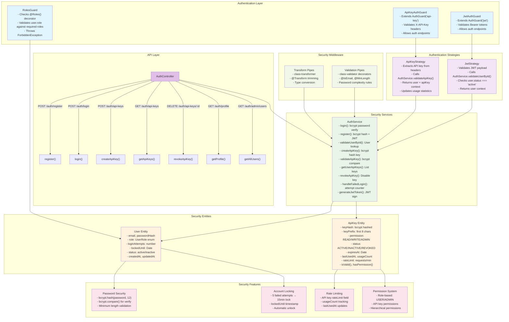

# Security and Best Practices

# Security and Best Practices

```mermaid
graph TB
    subgraph "API Layer"
        AC[AuthController]
        AC -->|"POST /auth/register"| AC1["register()"]
        AC -->|"POST /auth/login"| AC2["login()"]
        AC -->|"POST /auth/api-keys"| AC3["createApiKey()"]
        AC -->|"GET /auth/api-keys"| AC4["getApiKeys()"]
        AC -->|"DELETE /auth/api-keys/:id"| AC5["revokeApiKey()"]
        AC -->|"GET /auth/profile"| AC6["getProfile()"]
        AC -->|"GET /auth/admin/users"| AC7["getAllUsers()"]
    end

    subgraph "Authentication Layer"
        JWT["JwtAuthGuard<br/>- Extends AuthGuard('jwt')<br/>- Validates Bearer tokens<br/>- Allows auth endpoints"]
        API["ApiKeyAuthGuard<br/>- Extends AuthGuard('api-key')<br/>- Validates X-API-Key headers<br/>- Allows auth endpoints"]
        ROLES["RolesGuard<br/>- Checks @Roles() decorator<br/>- Validates user.role against required roles<br/>- Throws ForbiddenException"]
    end

    subgraph "Authentication Strategies"
        JWT_STRATEGY["JwtStrategy<br/>- Validates JWT payload<br/>- Calls AuthService.validateUserById()<br/>- Checks user.status === 'active'<br/>- Returns user context"]
        API_STRATEGY["ApiKeyStrategy<br/>- Extracts API key from headers<br/>- Calls AuthService.validateApiKey()<br/>- Returns user + apiKey context<br/>- Updates usage statistics"]
    end

    subgraph "Security Services"
        AUTH["AuthService<br/>- login(): bcrypt password verify<br/>- register(): bcrypt hash + JWT<br/>- validateUserById(): User lookup<br/>- createApiKey(): bcrypt hash key<br/>- validateApiKey(): bcrypt compare<br/>- getUserApiKeys(): List keys<br/>- revokeApiKey(): Disable key<br/>- handleFailedLogin(): attempt counter<br/>- generateJwtToken(): JWT sign"]
    end

    subgraph "Security Entities"
        USER["User Entity<br/>- email, passwordHash<br/>- role: UserRole enum<br/>- loginAttempts: number<br/>- lockedUntil: Date<br/>- status: active/inactive<br/>- createdAt, updatedAt"]
        API_KEY["ApiKey Entity<br/>- keyHash: bcrypt hashed<br/>- keyPrefix: first 8 chars<br/>- permission: READ/WRITE/ADMIN<br/>- status: ACTIVE/INACTIVE/REVOKED<br/>- expiresAt: Date<br/>- lastUsedAt, usageCount<br/>- rateLimit: requests/min<br/>- isValid(), hasPermission()"]
    end

    subgraph "Security Features"
        PWD["Password Security<br/>- bcrypt.hash(password, 12)<br/>- bcrypt.compare() for verify<br/>- Minimum length validation"]
        LOCK["Account Locking<br/>- 5 failed attempts → 15min lock<br/>- lockedUntil timestamp<br/>- Automatic unlock"]
        RATE["Rate Limiting<br/>- API key rateLimit field<br/>- usageCount tracking<br/>- lastUsedAt updates"]
        PERM["Permission System<br/>- Role-based: USER/ADMIN<br/>- API key permissions<br/>- Hierarchical permissions"]
    end

    subgraph "Security Middleware"
        VALID["Validation Pipes<br/>- class-validator decorators<br/>- @IsEmail, @MinLength<br/>- Password complexity rules"]
        TRANS["Transform Pipes<br/>- class-transformer<br/>- @Transform trimming<br/>- Type conversion"]
    end

    JWT --> JWT_STRATEGY
    API --> API_STRATEGY
    JWT_STRATEGY --> AUTH
    API_STRATEGY --> AUTH
    AUTH --> USER
    AUTH --> API_KEY
    ROLES --> USER
    USER --> PWD
    USER --> LOCK
    API_KEY --> RATE
    API_KEY --> PERM
    VALID --> AUTH
    TRANS --> AUTH
    AC --> AUTH

    classDef auth fill:#e1f5fe
    classDef strategy fill:#f3e5f5
    classDef service fill:#e8f5e8
    classDef entity fill:#fff3e0
    classDef feature fill:#fce4ec
    classDef middleware fill:#f1f8e9
    classDef controller fill:#e1bee7

    class AC controller
    class JWT,API,ROLES auth
    class JWT_STRATEGY,API_STRATEGY strategy
    class AUTH service
    class USER,API_KEY entity
    class PWD,LOCK,RATE,PERM feature
    class VALID,TRANS middleware
```