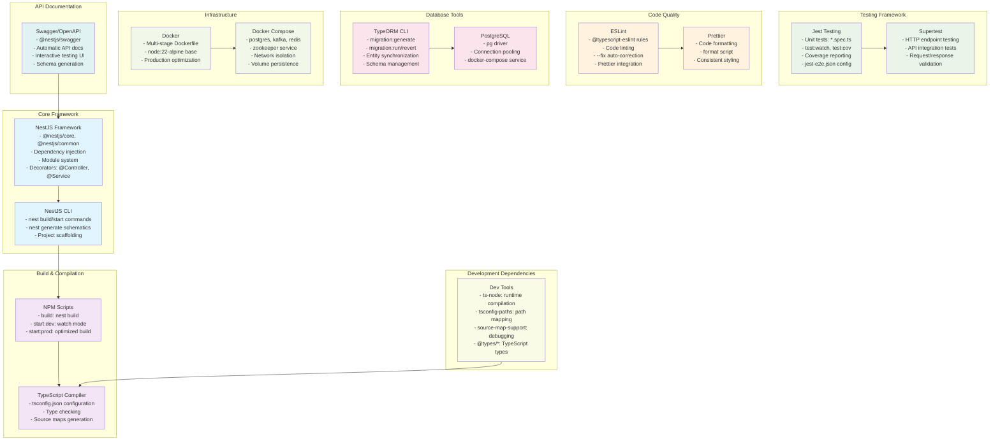

# Development Tools and Frameworks

# Development Tools and Frameworks

```mermaid
graph TB
    subgraph "Core Framework"
        NEST["NestJS Framework<br/>- @nestjs/core, @nestjs/common<br/>- Dependency injection<br/>- Module system<br/>- Decorators: @Controller, @Service"]
        CLI["NestJS CLI<br/>- nest build/start commands<br/>- nest generate schematics<br/>- Project scaffolding"]
    end

    subgraph "Build & Compilation"
        TSC["TypeScript Compiler<br/>- tsconfig.json configuration<br/>- Type checking<br/>- Source maps generation"]
        BUILD["NPM Scripts<br/>- build: nest build<br/>- start:dev: watch mode<br/>- start:prod: optimized build"]
    end

    subgraph "Testing Framework"
        JEST["Jest Testing<br/>- Unit tests: *.spec.ts<br/>- test:watch, test:cov<br/>- Coverage reporting<br/>- jest-e2e.json config"]
        SUPER["Supertest<br/>- HTTP endpoint testing<br/>- API integration tests<br/>- Request/response validation"]
    end

    subgraph "Code Quality"
        ESLINT["ESLint<br/>- @typescript-eslint rules<br/>- Code linting<br/>- --fix auto-correction<br/>- Prettier integration"]
        PRETTIER["Prettier<br/>- Code formatting<br/>- format script<br/>- Consistent styling"]
    end

    subgraph "Database Tools"
        TYPEORM["TypeORM CLI<br/>- migration:generate<br/>- migration:run/revert<br/>- Entity synchronization<br/>- Schema management"]
        PG["PostgreSQL<br/>- pg driver<br/>- Connection pooling<br/>- docker-compose service"]
    end

    subgraph "Infrastructure"
        DOCKER["Docker<br/>- Multi-stage Dockerfile<br/>- node:22-alpine base<br/>- Production optimization"]
        COMPOSE["Docker Compose<br/>- postgres, kafka, redis<br/>- zookeeper service<br/>- Network isolation<br/>- Volume persistence"]
    end

    subgraph "API Documentation"
        SWAGGER["Swagger/OpenAPI<br/>- @nestjs/swagger<br/>- Automatic API docs<br/>- Interactive testing UI<br/>- Schema generation"]
    end

    subgraph "Development Dependencies"
        DEP["Dev Tools<br/>- ts-node: runtime compilation<br/>- tsconfig-paths: path mapping<br/>- source-map-support: debugging<br/>- @types/*: TypeScript types"]
    end

    NEST --> CLI
    CLI --> BUILD
    BUILD --> TSC
    JEST --> SUPER
    ESLINT --> PRETTIER
    TYPEORM --> PG
    DOCKER --> COMPOSE
    SWAGGER --> NEST
    DEP --> TSC

    classDef framework fill:#e1f5fe
    classDef build fill:#f3e5f5
    classDef testing fill:#e8f5e8
    classDef quality fill:#fff3e0
    classDef database fill:#fce4ec
    classDef infra fill:#f1f8e9
    classDef docs fill:#e0f2f1
    classDef deps fill:#f9fbe7

    class NEST,CLI framework
    class TSC,BUILD build
    class JEST,SUPER testing
    class ESLINT,PRETTIER quality
    class TYPEORM,PG database
    class DOCKER,COMPOSE infra
    class SWAGGER docs
    class DEP deps
```