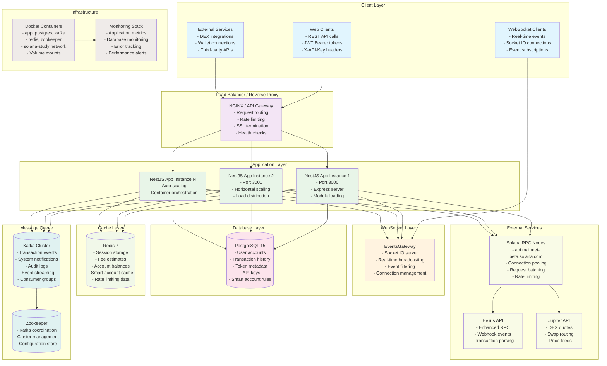

# Network Architecture

# Network Architecture

```mermaid
graph TB
    subgraph "Client Layer"
        WEB["Web Clients<br/>- REST API calls<br/>- JWT Bearer tokens<br/>- X-API-Key headers"]
        WS["WebSocket Clients<br/>- Real-time events<br/>- Socket.IO connections<br/>- Event subscriptions"]
        EXT["External Services<br/>- DEX integrations<br/>- Wallet connections<br/>- Third-party APIs"]
    end

    subgraph "Load Balancer / Reverse Proxy"
        NGINX["NGINX / API Gateway<br/>- Request routing<br/>- Rate limiting<br/>- SSL termination<br/>- Health checks"]
    end

    subgraph "Application Layer"
        APP1["NestJS App Instance 1<br/>- Port 3000<br/>- Express server<br/>- Module loading"]
        APP2["NestJS App Instance 2<br/>- Port 3001<br/>- Horizontal scaling<br/>- Load distribution"]
        APP3["NestJS App Instance N<br/>- Auto-scaling<br/>- Container orchestration"]
    end

    subgraph "WebSocket Layer"
        WS_GATEWAY["EventsGateway<br/>- Socket.IO server<br/>- Real-time broadcasting<br/>- Event filtering<br/>- Connection management"]
    end

    subgraph "Database Layer"
        POSTGRES[(PostgreSQL 15<br/>- User accounts<br/>- Transaction history<br/>- Token metadata<br/>- API keys<br/>- Smart account rules)]
    end

    subgraph "Cache Layer"
        REDIS[(Redis 7<br/>- Session storage<br/>- Fee estimates<br/>- Account balances<br/>- Smart account cache<br/>- Rate limiting data)]
    end

    subgraph "Message Queue"
        KAFKA[(Kafka Cluster<br/>- Transaction events<br/>- System notifications<br/>- Audit logs<br/>- Event streaming<br/>- Consumer groups)]
        ZOOKEEPER[(Zookeeper<br/>- Kafka coordination<br/>- Cluster management<br/>- Configuration store)]
    end

    subgraph "External Services"
        SOLANA_RPC["Solana RPC Nodes<br/>- api.mainnet-beta.solana.com<br/>- Connection pooling<br/>- Request batching<br/>- Rate limiting"]
        HELIUS["Helius API<br/>- Enhanced RPC<br/>- Webhook events<br/>- Transaction parsing"]
        JUPITER["Jupiter API<br/>- DEX quotes<br/>- Swap routing<br/>- Price feeds"]
    end

    subgraph "Infrastructure"
        DOCKER["Docker Containers<br/>- app, postgres, kafka<br/>- redis, zookeeper<br/>- solana-study network<br/>- Volume mounts"]
        MONITOR["Monitoring Stack<br/>- Application metrics<br/>- Database monitoring<br/>- Error tracking<br/>- Performance alerts"]
    end

    WEB --> NGINX
    WS --> WS_GATEWAY
    EXT --> NGINX
    NGINX --> APP1
    NGINX --> APP2
    NGINX --> APP3
    APP1 --> WS_GATEWAY
    APP2 --> WS_GATEWAY
    APP3 --> WS_GATEWAY
    APP1 --> POSTGRES
    APP2 --> POSTGRES
    APP3 --> POSTGRES
    APP1 --> REDIS
    APP2 --> REDIS
    APP3 --> REDIS
    APP1 --> KAFKA
    APP2 --> KAFKA
    APP3 --> KAFKA
    KAFKA --> ZOOKEEPER
    APP1 --> SOLANA_RPC
    APP2 --> SOLANA_RPC
    APP3 --> SOLANA_RPC
    SOLANA_RPC --> HELIUS
    SOLANA_RPC --> JUPITER
    DOCKER --> MONITOR

    classDef client fill:#e1f5fe
    classDef proxy fill:#f3e5f5
    classDef app fill:#e8f5e8
    classDef ws fill:#fff3e0
    classDef db fill:#fce4ec
    classDef cache fill:#f1f8e9
    classDef queue fill:#e0f2f1
    classDef external fill:#f9fbe7
    classDef infra fill:#efebe9

    class WEB,WS,EXT client
    class NGINX proxy
    class APP1,APP2,APP3 app
    class WS_GATEWAY ws
    class POSTGRES db
    class REDIS cache
    class KAFKA,ZOOKEEPER queue
    class SOLANA_RPC,HELIUS,JUPITER external
    class DOCKER,MONITOR infra
```