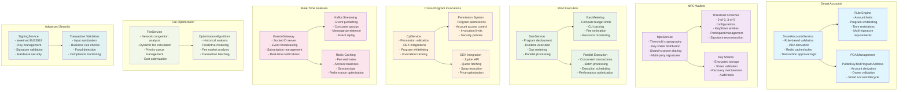

# Advanced Features

# Advanced Features

```mermaid
graph TB
    subgraph "Smart Accounts"
        SMART["SmartAccountsService<br/>- Rule-based validation<br/>- PDA derivation<br/>- Redis cached rules<br/>- Transaction approval logic"]
        RULES["Rule Engine<br/>- Amount limits<br/>- Program whitelisting<br/>- Time restrictions<br/>- Multi-signature requirements"]
        PDA["PDA Management<br/>- PublicKey.findProgramAddress<br/>- Account derivation<br/>- Owner validation<br/>- Smart account lifecycle"]
    end

    subgraph "MPC Wallets"
        MPC["MpcService<br/>- Threshold cryptography<br/>- Key share distribution<br/>- Shamir's secret sharing<br/>- Multi-party signatures"]
        THRESH["Threshold Schemes<br/>- 2-of-3, 3-of-5 configurations<br/>- KeyShare entities<br/>- Participant management<br/>- Signature reconstruction"]
        SHARES["Key Shares<br/>- Encrypted storage<br/>- Share validation<br/>- Recovery mechanisms<br/>- Audit trails"]
    end

    subgraph "SVM Execution"
        SVM["SvmService<br/>- Program deployment<br/>- Runtime execution<br/>- Gas metering<br/>- Parallel processing"]
        GAS["Gas Metering<br/>- Compute budget limits<br/>- CU tracking<br/>- Fee estimation<br/>- Resource monitoring"]
        PARALLEL["Parallel Execution<br/>- Concurrent transactions<br/>- Batch processing<br/>- Execution scheduling<br/>- Performance optimization"]
    end

    subgraph "Cross-Program Invocations"
        CPI["CpiService<br/>- Permission validation<br/>- DEX integrations<br/>- Program whitelisting<br/>- Invocation tracking"]
        PERMS["Permission System<br/>- Program permissions<br/>- Account access control<br/>- Invocation limits<br/>- Security policies"]
        DEX["DEX Integration<br/>- Jupiter API<br/>- Quote fetching<br/>- Swap execution<br/>- Price optimization"]
    end

    subgraph "Real-Time Features"
        WS["EventsGateway<br/>- Socket.IO server<br/>- Event broadcasting<br/>- Subscription management<br/>- Real-time notifications"]
        KAFKA["Kafka Streaming<br/>- Event publishing<br/>- Consumer groups<br/>- Message persistence<br/>- Event replay"]
        CACHE["Redis Caching<br/>- Fee estimates<br/>- Account balances<br/>- Session data<br/>- Performance optimization"]
    end

    subgraph "Fee Optimization"
        FEE["FeeService<br/>- Network congestion analysis<br/>- Dynamic fee calculation<br/>- Priority queue management<br/>- Cost optimization"]
        ALGO["Optimization Algorithms<br/>- Historical analysis<br/>- Predictive modeling<br/>- Fee market analysis<br/>- Transaction batching"]
    end

    subgraph "Advanced Security"
        SIGN["SigningService<br/>- tweetnacl Ed25519<br/>- Key management<br/>- Signature validation<br/>- Hardware security"]
        VALID["Transaction Validation<br/>- Input sanitization<br/>- Business rule checks<br/>- Fraud detection<br/>- Compliance monitoring"]
    end

    SMART --> RULES
    SMART --> PDA
    MPC --> THRESH
    MPC --> SHARES
    SVM --> GAS
    SVM --> PARALLEL
    CPI --> PERMS
    CPI --> DEX
    WS --> KAFKA
    WS --> CACHE
    FEE --> ALGO
    SIGN --> VALID

    classDef smart fill:#e1f5fe
    classDef mpc fill:#f3e5f5
    classDef svm fill:#e8f5e8
    classDef cpi fill:#fff3e0
    classDef realtime fill:#fce4ec
    classDef fee fill:#f1f8e9
    classDef security fill:#e0f2f1

    class SMART,RULES,PDA smart
    class MPC,THRESH,SHARES mpc
    class SVM,GAS,PARALLEL svm
    class CPI,PERMS,DEX cpi
    class WS,KAFKA,CACHE realtime
    class FEE,ALGO fee
    class SIGN,VALID security
```